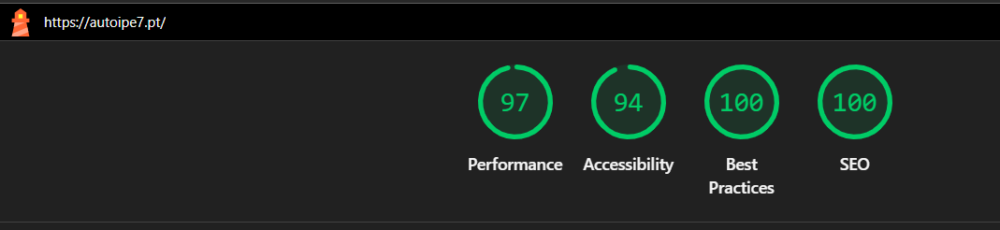

# Relatório de Testes e Auditoria de Qualidade - Auto IPE7

## 1. Visão Geral do Projeto
Este relatório documenta a fase de garantia de qualidade (QA) do site institucional **Auto IPE7**. O objetivo principal foi validar a experiência do utilizador em dispositivos móveis e a integridade das regras de negócio visuais, como o modo escuro persistente.

## 2. Escopo dos Testes
* **Funcionalidades:** Navegação entre seções, persistência do tema (Dark/Light Mode).
* **Não-Funcional:** Responsividade Mobile, Acessibilidade (WCAG) e Performance (Core Web Vitals).

## 3. Matriz de Execução
| Dispositivo | Navegador | Tipo de Teste | Resultado |
| :--- | :--- | :--- | :--- |
| Desktop (1920x1080) | Chrome | Funcional / UI | ✅ Passou |
| Mobile (iPhone SE) | Safari | Responsividade | ✅ Passou |
| Mobile (Pixel 7) | Chrome | Responsividade | ✅ Passou |

---

## 4. Evidências Técnicas

### A. Persistência de Dados (LocalStorage)
Foi validado que a escolha de tema do utilizador (Dark Mode) é salva localmente. Ao recarregar a página ou encerrar o navegador, o estado é mantido com 100% de sucesso, evitando o "flash" de luz indesejado.

### B. Auditoria Automatizada (Lighthouse)
O projeto apresenta altos índices de otimização, com os seguintes resultados obtidos na última auditoria:

* **Performance:** 97/100 
* **Acessibilidade:** 94/100 
* **Best Practices:** 100/100
* **SEO:** 100/100

> **Evidência Visual:**
>  

---

## 5. Gestão de Defeitos (Bug Report)

### ✅ Defeitos Resolvidos
* **ID #001:** Falha de sobreposição no menu mobile em ecrãs estreitos (Z-index).
    * **Correção:** Ajuste de posicionamento CSS para garantir visibilidade total dos itens.

### ⚠️ Defeitos em Backlog (Identificados via Lighthouse)
Como parte da análise crítica de QA, foram isolados os seguintes pontos que impediram a nota máxima de acessibilidade:

1. **Baixo Contraste no Footer:** O elemento `p.footer-copy.mt-3` apresenta ratio de contraste insuficiente.
    * **Impacto:** Dificulta a leitura para utilizadores com baixa visão.
2. **Hierarquia de Títulos:** Uso de tag `<h5>` para "Mecânica Geral" fora da ordem sequencial.
    * **Impacto:** Prejudica a navegação por tecnologias assistivas (leitores de ecrã).
3. **Landmark Principal:** Ausência da tag `<main>`.
    * **Impacto:** Má prática de semântica HTML que dificulta a identificação do conteúdo principal.

---

## 6. Próximos Passos
As correções de backlog já foram mapeadas e serão aplicadas na próxima janela de manutenção do projeto, visando atingir o score de **100/100** em todos os pilares da auditoria.

---
*Relatório gerado por Cleilton Silva - Aspirante a QA Júnior.*
