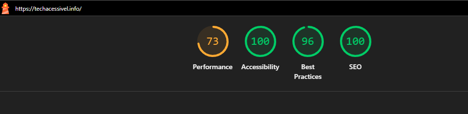

> **Projeto:** Tech Acessível | **Versão:** 1.0 | **Data:** 10/04/2026 | **Responsável:** Cleilton Silva | **Status:** Finalizado

---

# ♿ Relatório de Auditoria: Tech Acessível

Este documento detalha a auditoria técnica de qualidade e acessibilidade realizada no portal **Tech Acessível**, utilizando a metodologia Lighthouse e inspeção manual de ativos.

## 📋 Informações Gerais
- **URL:** [techacessivel.info](https://techacessivel.info/)
- **Ferramentas:** Lighthouse (Chrome DevTools), Axe DevTools
- **Dispositivo:** Mobile (Simulação Moto G Power)

---

## 📈 Resultados Lighthouse (Resumo)

| Categoria      | Nota | Status        |
|----------------|------|---------------|
| Performance    | 73   | ⚠️ Melhorar  |
| Acessibilidade | 100  | ✅ Excelente  |
| Best Practices | 96   | ✅ Excelente  |
| SEO            | 100  | ✅ Excelente  |

> **Nota de Destaque:** O projeto atingiu a nota máxima em **Acessibilidade**, validando o propósito principal da plataforma em ser inclusiva.

### Validação Axe DevTools
> ✅ **0 violações de acessibilidade** encontradas — confirma os resultados do Lighthouse.

---

## 🔍 Diagnóstico Técnico Detalhado

### 1. Performance (Oportunidades Críticas)
A nota de **73** deve-se principalmente ao tempo de carregamento do maior elemento da página (**LCP: 16.7s**).

* **Network Payload (Peso Total):** A página carrega **6,021 KiB** (aprox. 6MB), o que é excessivo para dispositivos móveis.
* **Ativos não otimizados:**
    * `Logoicone.png` (1,454 KiB) e `folder.png` (1,394 KiB) são os principais responsáveis pela lentidão.
    * `Cursos-online.png` (1,091 KiB) também apresenta peso fora dos padrões de performance web.
* **Scripts de Terceiros:** O *Google Tag Manager* entrega JavaScript não utilizado (economia estimada de 67 KiB).

### 2. Boas Práticas (Best Practices)
* **Aspect Ratio:** A imagem `logoprincipal.png` apresenta distorção (Aspect Ratio exibido: 1.85 vs. Original: 2.41).
* **Dimensões de Imagem:** Várias imagens de tutoriais (WhatsApp, Maps, Gmail) não possuem atributos `width` e `height` explícitos, causando instabilidade no layout durante o carregamento (CLS).

---

## 🛠️ Plano de Ação & Recomendações

| ID   | Ação | Impacto Estimado | Severidade | Prioridade |
|------|------|-----------------|------------|------------|
| #001 | Converter imagens `.png` para `.webp` / `.avif` | LCP: 16.7s → ~3s | Alta | P1 |
| #002 | Redimensionar `Logoicone.png` e `folder.png` para dimensões reais de exibição | Redução de ~90% no peso total | Alta | P1 |
| #003 | Adicionar atributos `width` e `height` em todas as tags `` | Melhora CLS e Best Practices | Média | P2 |
| #004 | Corrigir Aspect Ratio do `logoprincipal.png` | Elimina distorção visual | Média | P2 |
| #005 | Minificar `style.css` | Reduz tempo de parsing do CSS | Baixa | P3 |

---

## 📸 Evidência Técnica

---
**Responsável:** Cleilton Silva  
*Engenharia de Software & QA*
